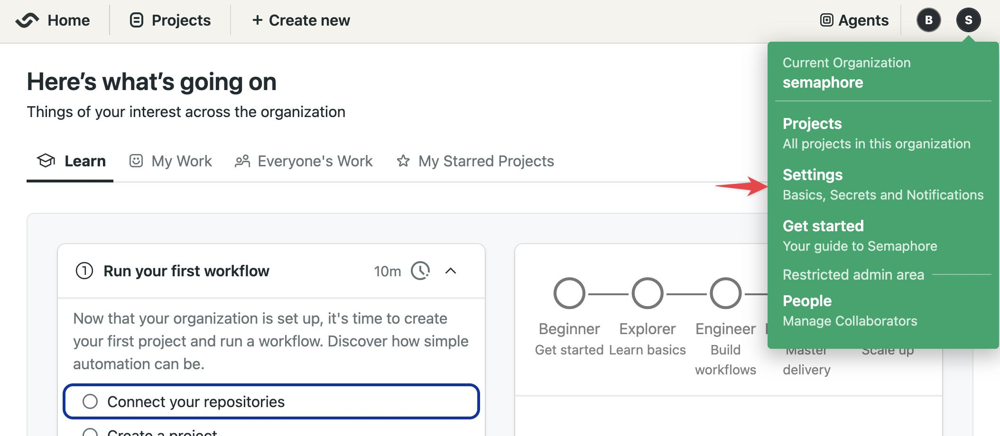
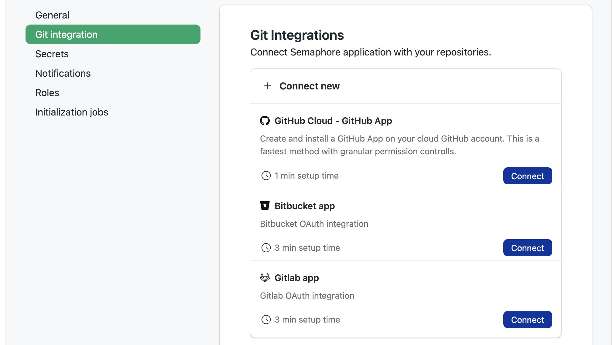

# Connect GitHub

import Tabs from '@theme/Tabs';
import TabItem from '@theme/TabItem';
import Available from '@site/src/components/Available';
import VideoTutorial from '@site/src/components/VideoTutorial';
import Steps from '@site/src/components/Steps';

GitHub users need to provide access to Semaphore so it can read their repositories.

## Overview

Semaphore accesses your GitHub repositories using the [Semaphore GitHub App](https://github.com/apps/semaphore-ci-cd). This method provides fine-grained control and per-repository permissions to control which code Semaphore can access.

You must install the GitHub App in order to create [projects](./projects) on Semaphore.

## How to authorize the GitHub App {#connect-ghapp}

To connect Semaphore with GitHub, follow these steps:

<Steps>

1. Open the server menu and select **Settings**

    

2. On **Git Integration** press **Connect**

    

3. Sign into your GitHub account
4. Select what type of access to authorize

    - **All repositories**: grant access to Semaphore to all your current *and future repositories*
    - **Only select repositories**: select from the list which repositories can be accessed by Semaphore

5. Press **Install**

</Steps>

:::note

You might not be able to install the GitHub App if you are not the GitHub organization owner. In this case, following these steps sends an installation request to the organization's owner. You cannot proceed until the owner authorizes the access.

:::

## How to transfer projects from OAuth to GitHub App {#transfer}

Projects [connected via the OAuth App](./connect-github-oauth) can be transferred to the [GitHub App](#connect-ghapp) at any time. You need to have installed the GitHub App in your organization before the transfer can take place.

To transfer projects, follow these steps:

<Steps>

1. Open the Semaphore [project](./projects) you want to transfer
2. Go to [Project Settings](./projects#settings) and select **Repository**
3. Press the button **Switch to GitHub App**
    

</Steps>

If the project was transferred successfully, you should get a message that says **Project connection type switched to GitHub app**.


Go to Project Settings and select Repository Settings.
If your project is using a personal token to connect to the repository, you will see the following screen:

## Troubleshooting guide

If your repositories aren't showing in Semaphore or changes are not triggering new workflows, check the connection between GitHub and Semaphore.

<Steps>

1. Navigate to your [Semaphore account](https://me.semaphoreci.com/account)
2. Read the status next to GitHub
    
3. If the status is disconnected, click on **Grant public access** or **Grant private access**

</Steps>

You can check and change the permissions of your OAuth App connection in the [Semaphore OAuth page](https://github.com/settings/connections/applications/328c742132e5407abd7d).

### Verify deploy key health {#deploy-key}

Semaphore generates a [deploy key](https://docs.github.com/en/authentication/connecting-to-github-with-ssh/managing-deploy-keys) when a [project](./projects) is created. This means there is a deploy key per repository connected to Semaphore.

When a deploy key is broken or invalid, Semaphore shows the following error message:

```text
git@github.com: Permission denied (publickey).
fatal: Could not read from remote repository.
```
To verify the status of a deploy key:

<Steps>

1. Open your [project settings](./projects#settings)
2. If there isn't a green check next to **Deploy Key**, the key is invalid


</Steps>

To deploy a new key, click on **Regenerate**

:::info

A deploy key can be invalidated if:

- it was manually removed from the repository
- access via OAuth or GitHub App was revoked
- the repository's original owner no longer has access to it (only for projects added [via OAuth](./connect-github-oauth))

:::

### Verify webhook health {#webhook}

Semaphore uses a webhook to detect changes in your repository. When the webhook is broken, Semaphore can't trigger new workflows.

To verify the status of a webhook:

<Steps>

1. Open your [project settings](./projects#settings)
2. If there isn't a green check next to **Deploy Key**, the key is invalid
    

</Steps>

To fix the broken webhook, click on **Regenerate**. This should generate a new webhook and repair the connection between Semaphore and GitHub.

### Reconnecting moved or renamed projects

There are several actions that can break the connection between GitHub and Semaphore. For example:

- moving the repository to a different location
- renaming the repository
- renaming the GitHub user account
- renaming the GitHub organization

When this happens, you must update the URL of the repository in Semaphore. To do this:

<Steps>

1. Open your [project settings](./projects#settings)
2. Type the new repository URL
3. Press **Change**
    

</Steps>

After changing the URL, double-check the status of the [deploy key](#deploy-key) and the [webhook](#webhook).

## See also

- [Getting Started Guide](../getting-started/guided-tour)
- [Using OAuth with GitHub](./connect-github-oauth)
- [How to connect with BitBucket](./connect-bitbucket)
