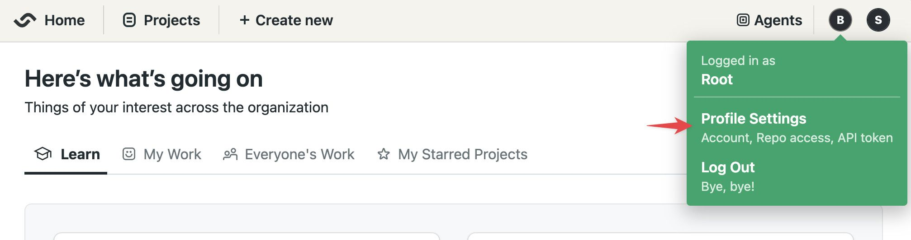
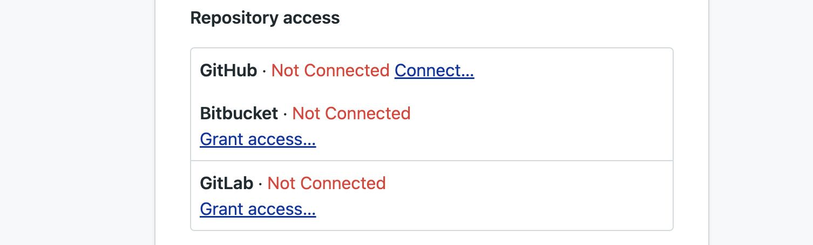
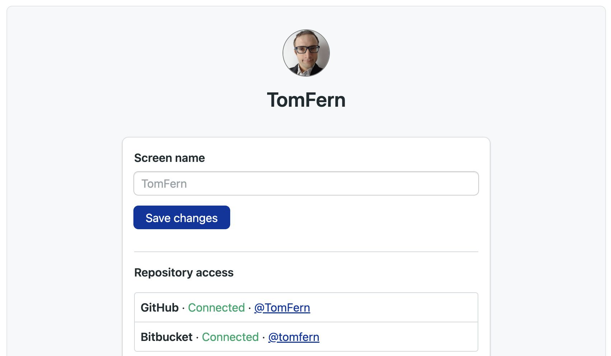
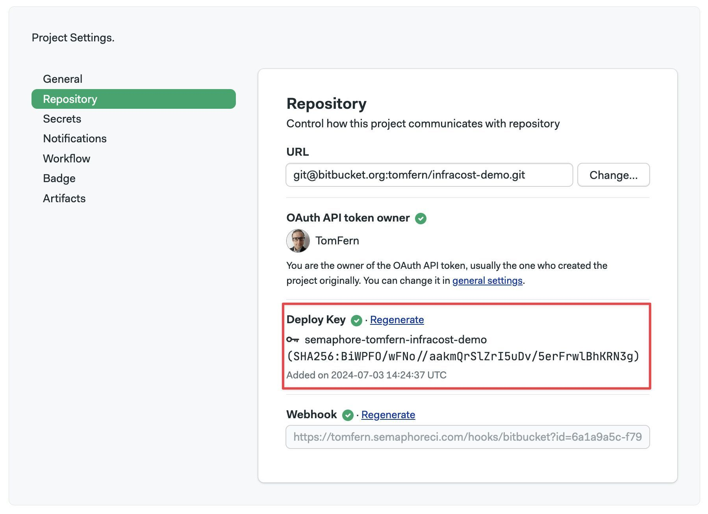
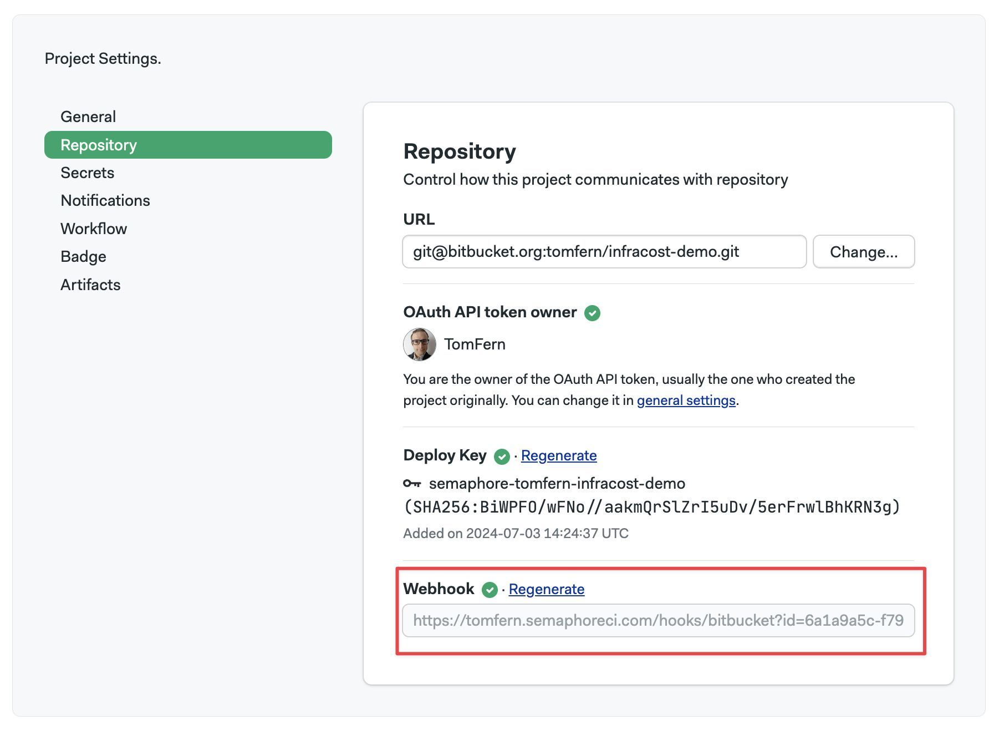
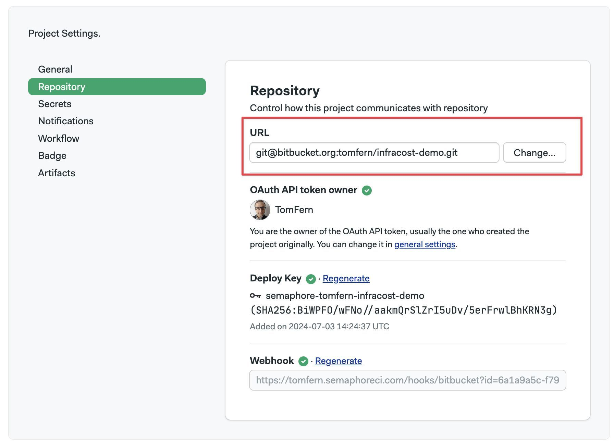

# Connect GitLab

import Tabs from '@theme/Tabs';
import TabItem from '@theme/TabItem';
import Available from '@site/src/components/Available';
import VideoTutorial from '@site/src/components/VideoTutorial';
import Steps from '@site/src/components/Steps';

GitLab users need to provide access to Semaphore so it can read their repositories.

## Overview {#overview}

You must connect Semaphore to your GitLab account in order to access your GitLab repositories.

## How to connect to GitLab {#connect-bitbucket}

To connect Semaphore to GitLab, follow these steps:

<Steps>

1. Select **Profile Settings** under your login menu

      

2. Click on **Grant access** next to GitLab

      

3. You are redirected to GitLab, log in and authorize Semaphore connection to proceed

</Steps>

## Troubleshooting guide

If your repositories aren't showing in Semaphore or changes are not triggering new workflows, check the connection between GitLab and Semaphore.

<Steps>

1. Navigate to your [Semaphore account](https://me.semaphoreci.com/account)
2. Read the status next to GitLab
    
3. If the status is disconnected, click on **Grant**

</Steps>

Your GitLab profile connection on this page can be in one of these states:

- **Not Connected**: your account is not connected. Next time you attempt to log in, you will need to grant access to Semaphore again.
- **Connected**: can connect both private and public repositories via OAuth. 

You can check and change the permissions of your OAuth App connection on the [GitLab authorization page](https://bitbucket.org/account/settings/app-authorizations/).

### Verify deploy key health {#deploy-key}

Semaphore generates a [deploy key](https://docs.github.com/en/authentication/connecting-to-github-with-ssh/managing-deploy-keys) when a [project](./projects) is created. This means there is a deploy key per repository connected to Semaphore.

When a deploy key is broken or invalid, Semaphore shows the following error message:

```text
git@github.com: Permission denied (publickey).
fatal: Could not read from remote repository.
```

To verify the status of a deploy key:

<Steps>

1. Open your [project settings](./projects#settings)
2. If there isn't a green check next to **Deploy Key**, the key is invalid
    

</Steps>

To deploy a new key, click on **Regenerate**.

:::info

A deploy key can be invalidated if:

- it was manually removed from the repository
- OAuth permissions were revoked
- the repository's original owner no longer has access to it

:::

### Verify webhook health {#webhook}

Semaphore uses a webhook to detect changes in your repository. When the webhook is broken, Semaphore can't trigger new workflows.

To verify the status of a webhook:


<Steps>

1. Open your [project settings](./projects#settings)
2. If there isn't a green check next to **Deploy Key**, the key is invalid
    

</Steps>

To fix the broken webhook, click on **Regenerate**. This should generate a new webhook and repair the connection between Semaphore and GitHub.

### Reconnecting moved or renamed projects

There are several actions that can break the connection between GitLab and Semaphore. For example:

- moving the repository to a different location
- renaming the repository
- renaming the GitLab user account

When this happens, you must update the URL of the repository in Semaphore. To do this:

<Steps>

1. Open your [project settings](./projects#settings)
2. Type the new repository URL
3. Press **Change**
    

</Steps>

After changing the URL, double-check the status of the [deploy key](#deploy-key) and the [webhook](#webhook).

## See also

- [Projects](./projects)
- [Getting Started Guide](../getting-started/guided-tour)
- [Managing Semaphore servers](./organizations)
- [How to connect with GitHub](./connect-github)

