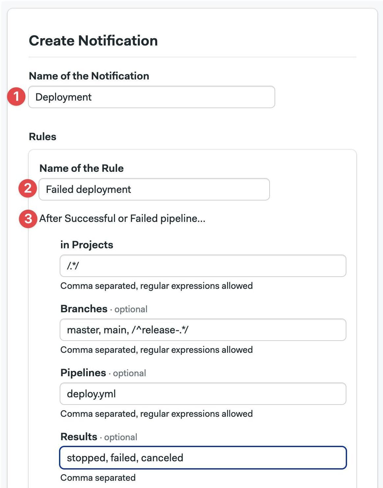
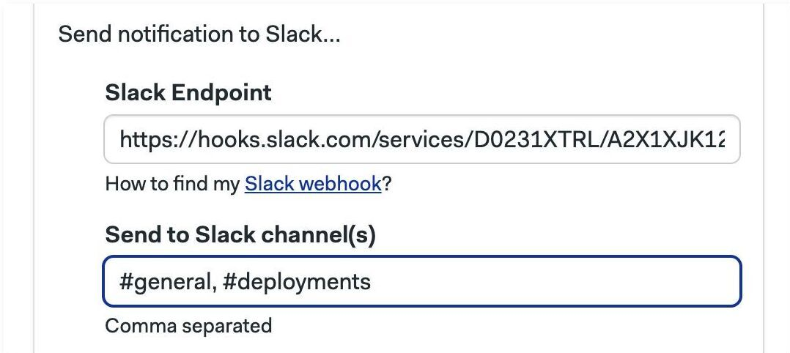
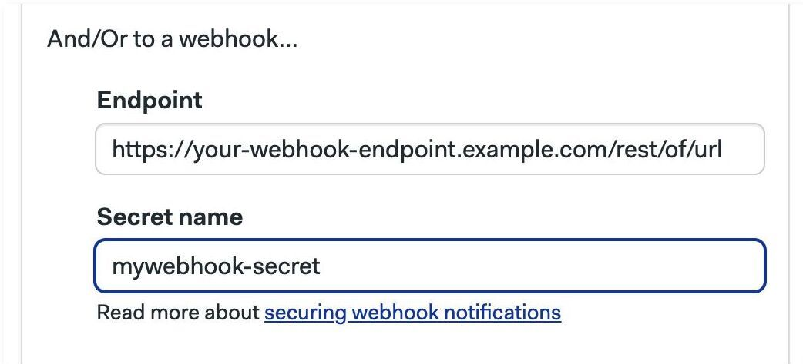

# Notifications

import Tabs from '@theme/Tabs';
import TabItem from '@theme/TabItem';
import Available from '@site/src/components/Available';
import VideoTutorial from '@site/src/components/VideoTutorial';
import Steps from '@site/src/components/Steps';

Get notified via Slack or any other webhook-based service when important things happen.

## Slack and webhook notifications {#slack-notifications}

Send notifications to Slack and other webhook-based services. Notifications are sent when a pipeline finishes running so your team get instant feedback on the result. 

To set up a Slack notification, first you need to configure an [incoming webhook](https://slack.com/apps/A0F7XDUAZ-incoming-webhooks) in your Slack workspace.

:::tip

Always use [Incoming Webhooks app](https://semaphore.slack.com/apps/A0F7XDUAZ-incoming-webhooks) instead of creating your own Endpoint on Slack. If you set up a notification with an endpoint from your custom Slack app, you won't be able to use the channel override feature.

:::

<Tabs groupId="ui-cli">
<TabItem value="ui" label="UI">

To create a notification, navigate to **Notifications** and press **New Notification**

<Steps>

1. Type the name of the notification
2. Type the name of the rule to fires the notification
3. You can supply optional filters for this rule:
   - **Projects**: comma-separated list of [projects](./projects) where it applies
   - **Branches**: comma-separated list of Git branches
   - **Pipelines**: comma-separated list [pipeline](./pipelines) YAML files that need to run in order to fire the notification
   - **Results**: comma-separated list of results. Valid values are: "passed", "failed", "stopped", or "canceled"

    <br/>

    <details>
    <summary>Show me</summary>
    <div>
    
    </div>
    </details>

</Steps>


:::note

Regular expressions must wrapped in forward slashes, e.g. `/.*/` matches all values. You can use regular expressions in Projects, Branches, and Pipelines.

:::

To send Slack notifications:

<Steps>

1. Copy the [Slack webhook](https://slack.com/help/articles/360041352714-Build-a-workflow--Create-a-workflow-that-starts-outside-of-Slack) for your Slack Workspace
2. Type the comma-separated list of channels to receive the message

    <details>
    <summary>Show me</summary>
    <div>
    
    </div>
    </details>

</Steps>

To send notifications to other webhook-based services:


<Steps>

1. Create a server [secret](./secrets#org-secrets) containing the environment variable `WEBHOOK_SECRET` and a secret value. Remember the name of this secret, e.g. "mywebhook-secret"
2. Copy the URL of the webhook that receives the notification
3. Type the name of the secret created on step 1, e.g. "mywebhook-secret"

    <details>
    <summary>Show me</summary>
    <div>
    
    </div>
    </details>

</Steps>

:::note

The value contained in the secret is sent along with the payload on notification to help secure the message. You can should validate that the secret value matches before accepting the message on the receiving end.

:::


At this point, you can create additional rules or save the changes by pressing **Save Notification**.

</TabItem>
<TabItem value="cli" label="CLI">

To create a Slack notification, install and connect the [Semaphore command line](../reference/semaphore-cli) and execute:

```shell title="Creating an Slack Notification"
sem create notification <name> \
    --projects <project_name> \
    --slack-endpoint <slack-webhook-endpoint>
```


Use the [Slack webhook](https://slack.com/help/articles/360041352714-Build-a-workflow--Create-a-workflow-that-starts-outside-of-Slack) for your Slack Workspace

For example, to create a notification on the "web", "cli", and "api" projects on the "master" branch:


```shell title="Sending Slack notifications on a list of projects"
sem create notification master-pipelines \
    --projects "web,cli,api" \
    --branches master \
    --slack-endpoint <slack-webhook-endpoint>
```

You can enable notifications only for a subset of the [pipelines](./pipelines):

```shell title="Sending Slack notifications for pipelines"
sem create notifications example \
    --projects "web" \
    --branches "master" \
    --pipelines "prod.yml" \
    --slack-endpoint <slack-webhook-endpoint>
```

To send notifications on multiple Slack channels add `--slack-channels`:

```shell title="Sending Slack notifications on channels"
sem create notifications new-releases \
    --projects "web,cli,api" \
    --branches "master" \
    --slack-endpoint <slack-webhook-endpoint> \
    --slack-channels "#dev-team,#qa-team"
```

The `--branches`, `--projects` and `--pipelines` options accept regular expressions. For example:

```shell title="Sending Slack notifications on branches"
sem create notifications example \
    --projects "/.*api$/" \
    --branches "master,/hotfix\/.*/" \
    --pipelines "/prod-.*/" \
    --slack-endpoint <slack-webhook-endpoint>
```

:::note

Regex matches must be wrapped in forward slashes (e.g. `/.*/`). Specifying a branch name without slashes (e.g. `.*`) will execute a direct equality match.

:::

The `sem create notification` command can be used to set up custom webhook-based notifications. The same options in Slack notification apply, simply replace `--slack-endpoint` with `--webhook-endpoint`

```shell title="Creating a webhook-based notification"
sem create notification <name> \
    --projects <project_name> \
    --webhook-endpoint <webhook-endpoint>
```

You can secure the notification by adding a secret. That way, the receiving endpoint can validate the payload. 

To add a password to your notification:


<Steps>

1. Create a server [secret](./secrets#org-secrets) containing the environment variable `WEBHOOK_SECRET` and a secret value. Remember the name of this secret, e.g. "mywebhook-secret"
2. Add `--webhook-secret` to the command:
    ```shell title="Securing a webhook-based notification"
    sem create notifications <name> \
        --webhook-endpoint <webhook-endpoint> \
        --webhook-secret <semaphore-secret-name>
    ```

</Steps>

:::info

Semaphore includes the signature in the `X-Semaphore-Signature-256` header when the webhook secret is present. Semaphore uses an HMAC-SHA256 to compute the signature of the request body.

:::


</TabItem>
</Tabs>


## Manage notifications from the CLI

You can use the [Semaphore command line tool](../reference/semaphore-cli) to view, delete and edit notifications:

- List notifications with: `sem get notifications`
- Describe a notification with: `sem get notifications <name>`
- Edit a notification with: `sem edit notification <name>`
- Delete a notification with: `sem delete notification <name>`

## Notification payload

The payload contains all the information related to a pipeline.

```json title="Notification payload"
{
    "version": "1.0.0",
    "organization": {
        "name": "semaphore",
        "id": "36360e31-fee6-42b2-9f6c-999d4c06ce81"
    },
    "project": {
        "name": "notifications",
        "id": "91e34570-bebe-42b6-b47a-ca710b2b8927"
    },
    "repository": {
        "url": "https://github.com/semaphoreci/myproject",
        "slug": "semaphoreci/notifications"
    },
    "revision": {
        "tag": null,
        "sender": {
            "login": "radwo",
            "email": "184065+radwo@users.noreply.github.com",
            "avatar_url": "https://avatars2.githubusercontent.com/u/184065?v=4"
        },
        "reference_type": "branch",
        "reference": "refs/heads/rw/webhook_impl",
        "pull_request": null,
        "commit_sha": "2d9f5fcec1ca7c68fa7bd44dd58ec4ff65814563",
        "commit_message": "empty",
        "branch": {
            "name": "rw/webhook_impl",
            "commit_range": "36ebdf6e906cf3491391442d2f779b512ca49485...2d9f5fcec1ca7c68fa7bd44dd58ec4ff65814563"
        }
    },
    "workflow": {
        "initial_pipeline_id": "fa02c7bd-7a8b-42e0-8d6e-aa0d8a194e19",
        "id": "acabe58e-4bcc-4d39-be06-e98d71917703",
        "created_at": "2019-12-10T13:09:54Z"
    },
    "pipeline": {
        "yaml_file_name": "semaphore.yml",
        "working_directory": ".semaphore",
        "stopping_at": "2019-12-10T13:10:22Z",
        "state": "done",
        "running_at": "2019-12-10T13:09:58Z",
        "result_reason": "user",
        "result": "stopped",
        "queuing_at": "2019-12-10T13:09:55Z",
        "pending_at": "2019-12-10T13:09:55Z",
        "name": "Notificaitons",
        "id": "fa02c7bd-7a8b-42e0-8d6e-aa0d8a194e19",
        "error_description": "",
        "done_at": "2019-12-10T13:10:28Z",
        "created_at": "2019-12-10T13:09:54Z"
    },
    "blocks": [
        {
            "state": "done",
            "result_reason": "user",
            "result": "stopped",
            "name": "List & Test & Build",
            "jobs": [
                {
                    "status": "finished",
                    "result": "stopped",
                    "name": "Test",
                    "index": 1,
                    "id": "21df03d2-c4e0-4e0a-acd7-5ff60dc0727e"
                },
                {
                    "status": "finished",
                    "result": "stopped",
                    "name": "Build",
                    "index": 2,
                    "id": "84190263-362c-4051-8260-e43637f148de"
                },
                {
                    "status": "finished",
                    "result": "passed",
                    "name": "Lint",
                    "index": 0,
                    "id": "d4b93a5b-69a5-43e6-ab24-06b095fc49bf"
                }
            ]
        }
    ]
}
```

In this example, `revision.pull_request` and `revision.tag` are null because the payload is related to a pipeline run started via a push to the branch. Information about this is kept in the `revision.reference_type` file.

Sample `pull_request` object:

```json title="Pull request object"
"pull_request": {
  "head_repo_slug": "semaphoreci/notifications",
  "number": 2,
  "name": "Add docs for webhook notifications",
  "head_sha": "9872252e00ac5a6b5870cdf94efe0e04770ad104",
  "branch_name": "webhook_notifications",
  "commit_range": "9872252e00ac5a6b5870cdf94efe0e04770ad104^..9872252e00ac5a6b5870cdf94efe0e04770ad104"
}
```

Sample `tag` object:

```json title="Tag object"
"tag": {
  "name": "v1.0.1",
}
```

## See also

- [How to create notifications using YAML](../reference/semaphore-cli#notifications)
