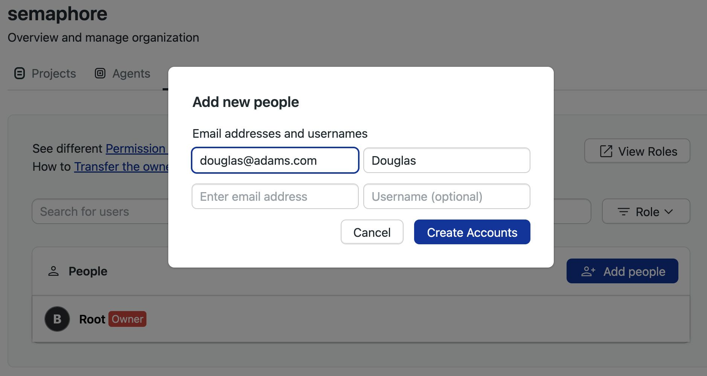

# Managing Semaphore

import Tabs from '@theme/Tabs';
import TabItem from '@theme/TabItem';
import Available from '@site/src/components/Available';
import VideoTutorial from '@site/src/components/VideoTutorial';
import Steps from '@site/src/components/Steps';

This page explains how to set up [notifications](./notifications), manage users, and what settings are available in your Semaphore instance. On Semaphore Community Edition, we use the terms server, instance, and organization interchangeably.

## Overview {#overview}

In order to access any non-public resources on Semaphore you must be invited to the Semaphore instance.

If you are trying out Semaphore for the first time, we suggest the [Guided Tour](../getting-started/guided-tour), where we show how to get started quickly.

A Semaphore instance has:

- zero or more [projects](./projects)
- one or more owners
- users [role-based permissions](./rbac)
- a dedicated URL, for example, `https://semaphore.example.com`

## Managing users {#people}

Semaphore users a [Role Based Access Control](./rbac) model to manage permissions at the instance level. You can add up to 500 persons to your instance.

To manage users in your Semaphore instance, open the server menu and select **People**. This tab shows users and groups in your instance along with their roles and groups.

### How to invite users {#add-people}

To invite a user to your instance, press the **Add people** button.

<Steps>

1. Type the email of the person you wish to invite
2. Optionally, set a username. If not provided, the username is inferred from the email
3. Press **Create Accounts**
4. Take note of the temporary passwords. On first login, users are prompted to change their passwords

</Steps>

### How to remove users {#remove-users}

Users can only be removed from the instance when they don't own any projects. You must [transfer the ownership](./projects#owner-change) of all the user's projects before they can be removed from Semaphore.

To remove users from the Semaphore instance:

<Steps>

1. Transfer any [project ownership](./projects#owner-change) the user may have to another individual. The user must not own any projects
2. Open the server menu
3. Select **People**
4. Press the **X** button next to the username of the user you want to remove

  

</Steps>

Upon removal, access to all projects in Semaphore are revoked.

:::note

Only an Admins and Owners can remove users from the Semaphore instance.

:::

### How to change user roles {#roles-people}

To change the role of a user, press the **Change Role** button next to the person.

See [roles](./rbac#org) to learn what roles are available.

### How to view permissions for roles {#org-roles}

Semaphore provides pre-defined roles. These permissions cannot be changed. You can see what actions each role can perform by following these steps:

<Steps>

1. Open the server **Settings** menu
2. Select **Roles**
    
3. In the **Organization Roles** section, press the eye button next to the role you want to examine

</Steps>

The actions with enabled checkbox are allowed for that role.

## Instance settings {#org-settings}

To access your settings, open the server menu and click on **Settings**.

### General settings {#general-settings}

This page shows the main settings for your instance. Here, you can change its name, and control how [workflows](./workflows) run.

:::info

The *URL of your server* is the URL that leads to the Home page in your Semaphore instance. For example `semaphore.example.com`

:::

### Notifications {#slack-notifications}

You can set up Slack and other webhook-based notifications to get your team notified whenever there [project](./projects) finishes running.

To learn more, see the [notification documentation](./notifications.md)

### Initialization agent {#init-agent}

Some types of pipelines require [initialization job](./pipelines#init-job) to evaluate and compile the them before the workload beings.

Semaphore tries to pick the best type of agent automatically but you change it for the whole server. This is particularly useful when you are using [self-hosted agents](./self-hosted).

To change the initialization job agent for all your [projects](./projects) in your Semaphore instance, follow these steps:

<Steps>

1. Select **Initialization job** from the settings menu
2. Select the **Environment type**
3. Select the **Machine type**
4. Select the **OS image** (if available)
5. Press **Save**

  

</Steps>

:::info

If you experience errors during initialization, see the [initialization job logs](./pipelines#init-logs) to help troubleshoot the issue.

:::

## Project queues {#queue}

You can use queues to control the order in which pipelines are executed in your instance. See [named queues](./pipelines#named-queues) for more information.

## Activity monitor {#activity-monitor}

The activity monitor show the [agent](./pipelines#agents) utilization and the currently running pipelines.

To view the activity monitor, open your server menu and select **Activity Monitor**.

In the activity monitor, you can see the machine quota utilization for your instance. Here, you can have an overview on how Semaphore Cloud machines and [self-hosted agents](./self-hosted) are being used.

In the lower part of the activity monitor you can find the currently running workflows for all the [projects](./projects) in your instance. Use this to know what [jobs](./jobs) are running, and see which ones are waiting in the queue to debug usage issues.

## See also

- [How to configure notifications](./notifications)
- [How to configure projects](./projects)
