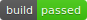

# Projects

import Tabs from '@theme/Tabs';
import TabItem from '@theme/TabItem';
import Available from '@site/src/components/Available';
import VideoTutorial from '@site/src/components/VideoTutorial';
import Steps from '@site/src/components/Steps';

Projects are codebases developed and managed through Semaphore [Continuous Integration](https://semaphoreci.com/continuous-integration). A project links your Git repository with Semaphore, so it can run [jobs](./jobs) to test, build, or deploy your application. 

This page explains how to set up projects and what settings are available. Before you can create a project you must connect Semaphore to [GitHub](./connect-github) or [BitBucket](./connect-bitbucket).

## Create a project {#create-project}

<VideoTutorial title="Create a Project" src="https://www.youtube.com/embed/Y4Ac5EJpzEc?si=INZVrNw4LTWg3l6k"/>

To create a Semaphore project you need:

- A [Semaphore installation](../getting-started/install)
- A GitHub or Bitbucket account
- A repository with at least one commit
- Set up Semaphore to connect to your repositories:
  - [How to connect to GitHub](./connect-github)
  - [How to connect to Bitbucket](./connect-bitbucket)

<Tabs groupId="ui-cli">
<TabItem value="ui" label="UI">

Go to Semaphore, press **+Create New** 1 and then press **Choose repository**


<Steps>

1. Select the GitHub or Bitbucket tab. You may need to press the **Connect account** button if this is the first time
2. Select the repository from the list and press on **Choose**

    <details>
    <summary>Show me</summary>
    <div>
    
    </div>
    </details>

3. Optionally, [add people](./organizations#people) to the project. Press **Continue**

    <details>
    <summary>Show me</summary>
    <div>
    
    </div>
    </details>

4. Select a started workflow. If in doubt, select **Single Job** and **Start**

    <details>
    <summary>Show me</summary>
    <div>
    
    </div>
    </details>

</Steps>

Semaphore creates a new [pipeline](./pipelines) file in the `.semaphore` folder in the repository and starts working.


</TabItem>
<TabItem value="cli" label="CLI">

After installing and connecting the [Semaphore command line](../reference/semaphore-cli):

<Steps>

1. Clone the repository in your machine
2. Run `sem init` at the root of the repository
3. Push a change to get Semaphore working
 
    ```shell title="Push pipeline to the repository
    git add .semaphore
    git commit "Initalize Semaphore"
    git push origin main
    ```

    

</Steps>

You can override the project name and URL by using [additional options](../reference/semaphore-cli#sem-edit)

```shell
sem init --project-name <project_name> --project-url <project_url>
```

If you get permission or not find error message, double check the connection between Semaphore and your Git provider:
- [How to connect to GitHub](./connect-github)
- [How to connect to Bitbucket](./connect-bitbucket)

</TabItem>
</Tabs>

## View projects {#view-projects}

<Tabs groupId="ui-cli">
<TabItem value="ui" label="UI">

You can find your projects in Semaphore by pressing on the **Projects** tab and searching by project name.


Semaphore shows the latest activity in the last few days when logging in. 


</TabItem>
<TabItem value="cli" label="CLI">

To get the list of the projects in your server, run [sem get](../reference/semaphore-cli) to list your projects:

```shell
$ sem get project
NAME                                 REPOSITORY
semaphore-demo-flutter               git@github.com:semaphoreci-demos/semaphore-demo-flutter.git
hello-semaphore                      git@github.com:semaphoreci-demos/hello-semaphore.git
```

</TabItem>
</Tabs>

## Workflow triggers {#triggers}

See [workflow triggers](./workflows#project-triggers)

The following actions in the repository can trigger Semaphore to start the project's pipelines.

- Pushing commits into any branch
- Pushing Git tags
- Creating pull requests from the same repository
- Creating pull requests originating from a forked repository
- Updating any of the project's pipelines using the [visual editor](./workflows#workflow-editor)
- Pressing the Run button on the Semaphore website
- Request a re-run using the [Semaphore API](../reference/api)
- Scheduling workflows [using Tasks](./tasks)

<!-- new api: Requesting a re-run [using the API](../openapi-spec/workflows-reschedule) -->

The reason for the trigger can be determined at runtime by examining the Semaphore environment variables in the job. See the [environment variable reference page](../reference/env-vars#semaphore) for more details.

### How pull requests are handled {#pr}

Semaphore starts a workflow for every push to a pull request originating from a forked repository. For security reasons, secrets are disabled in jobs triggered in this way. You can [create an allow list](#settings-triggers) with the secrets you want to expose in the project settings.

:::note

Instead of pushing the HEAD commit to the pull request, Semaphore uses the MERGE commit between the source and the upstream branch. You can find the SHA of the HEAD commit of the Pull Request in the [`SEMAPHORE_GIT_PR_SHA`](../reference/env-vars#pr-sha) environment variable.

:::

## Project tabs {#manage-projects}

Project members can view or manage the following project elements:

- **Activity**: shows the latest [pipeline](./pipelines) runs
- **Artifacts**: shows the [project-level artifacts](./artifacts#projects) and [retention policy](./artifacts#retention)
- **Tasks**: shows the [tasks](./tasks)
- **People**: shows or changes the [project members](#people)
- **Settings**: shows the [project-level settings](#settings)


## How to manage access to projects {#people}

Semaphore periodically syncs users from GitHub. You can add and remove people from the project by inviting or removing them from the related repository.

Users with [Admin](./rbac#org-admin) or [Owner](./rbac#org-owner) roles can access every project in their servers — even if they don't have access to the related repository.

### About project permissions {#about}

TODO: does this apply to CE?

Users can be granted access and permissions on a project by different means:

- **Repository-level access**: Semaphore automatically syncs user permissions from GitHub. See [project roles](./rbac#project) to learn how repository permissions are mapped to project permissions
- **Direct access**: users can be [directly added to and removed from the project](#manual). Their permissions are managed with [project roles](./rbac#project)
- **Role access**: users with [Admin](./rbac#org-admin) or [Owner](./rbac#org-owner) roles can access every project in their server

### How to manually add/remove members to projects {#manual}

To add or remove a user from a project, follow these steps:

<Steps>

1. Ensure the user is [already part of the Semaphore server](./organizations#add-people)
2. Open your project
3. Select the **People** tab
4. Press **Add People**
5. Type the names of the users to add
6. Press **Add selected**

    

</Steps>

- To remove the user from the project, press the **X** button next to the user.

### How to change permissions {#people-roles}

<Available plans={['Scaleup']}/>

TODO: check if we can manually change members permissions in projects in Semaphore (or if it musst go through the Git repo)

Open your project and go to the **People** tab

<Steps>

1. Press the **Change role** next to the project member
2. Select the new role

    

</Steps>

### How to view pre-defined roles {#project-roles}

Semaphore provides pre-defined roles for projects. You can see what actions each role can perform by following these steps:

<Steps>

1. Open the server **Settings** menu
2. Select **Roles**
    
3. Scroll down to **Project roles**
4. Press the eye button next to the role you want to examine

</Steps>

The actions with enabled checkbox are allowed for that role.

### How to change the project's owner {#owner-change}

Open the [project settings](#settings), under **Project Owner** type the username and press **Change**. The user must already have been [invited to the server](./organizations#add-people).


After project ownership has been transferred, you need to push a new commit. Re-running old builds no longer works once the ownership of a project has changed.

:::note

Transferring ownership does not automatically grant [project roles](./rbac#project) on the project. You must still manually grant the [admin role](./rbac#project-admin) to allow the new owner manage the project.

:::

## Settings {#settings}

The **Settings** tab in your project allows you to customize your project settings, add project-level secrets, and manage [artifacts](./artifacts)

### Project settings {#general}

In the general project settings, you can: 

- [Change the owner](#owner-change) of the project
- Change the visibility of the project
- Change the project name or description
- Delete the project


### Workflow triggers {#settings-triggers}

See [workflow triggers](./workflows#project-triggers) to learn how to customize what actions trigger a workflow.

### Repository {#settings-repo}

In **Repository** settings page you can:

- change the URL of your Git repository if you moved it
- configure or reinstall the [GitHub](./connect-github) or [Bitbucket](./connect-bitbucket) connections
- regenerate the [git webhook](./connect-github) if Semaphore is not picking up on the remote changes


### Project secrets {#project-secrets}

In **Secrets** page, you can create project-level [secrets](./secrets.md). These are only accessible for this project and not globally to all the server.

To learn how to create project secrets, see the [secrets documentation page](./secrets#create-project-secrets).

<!-- new api: [API reference page](../openapi-spec/project-secrets-list) -->

### Badges {#badges}

The **Badge** settings page shows you [shields](https://shields.io/) embed codes for your README or any webpage, allowing team members and users about the build status of your project.

To get a badge embed code:

<Steps>

1. Type the branch name you want to show the status for. This is typically "main" or "master"
2. Select a badge style. This is only a style choice
3. Choose the file format where you will embed the badge
4. Copy the code into your README or webpage

    

</Steps>

Badge URLs follow the following format for the "master" branch:

```text
https://<semaphore-server-url>/badges/<PROJECT-NAME>.svg
```

On other branches the format is:

```text
https://<semaphore-server-url>/badges/<PROJECT-NAME>/branches/<BRANCH-NAME>.svg
```

The visual style of the badge can also be customized. There are two styles:

| Style | Example |
|--|--|
| Semaphore (default) |  |
| Shields |  |

The Semaphore style is the default. To use shields style, add `?style=shields` to the URL. For example:

```text
https://semaphore.<your-domain>/badges/<PROJECT-NAME>.svg?style=shields
```

### Artifacts {#artifacts}

The **Artifacts** settings page lets you configure the [artifact](./artifacts) retention policy.

To learn more, see the [artifacts retention page](./artifacts#retention)

### How to change init agent {#init-agent}

To change the agent that runs the initialization job, see [set initialization agent for job](./organizations#init-agent).


## How to configure status checks {#status-checks}

Semaphore sends status checks to your GitHub or BitBucket repositories. Status checks show the latest Semaphore activity right in your repository.

Status checks appear in the commit messages.


And also on pull requests.


Semaphore only reports status checks on the initial pipeline (`.semaphore/semaphore.yml`). But you can configure status checks on any other pipelines in the workflows or even on blocks.

### Edit status checks

Status checks can only be configured using the [Semaphore Command Line](../reference/semaphore-cli#sem-edit).

To add status checks on other non-initial pipelines, follow these steps:

<Steps>

1. Edit your project resource using `sem edit` on a terminal

    ```shell
    sem edit project <project-name>
    ```

2. The project configuration is opened in the default text editor. For example:


        ```yaml
        apiVersion: v1alpha
        kind: Project
        metadata:
          name: example
        
        spec:
          repository:
            url: "git@{github|bitbucket}.com:renderedtext/example.git"
            run: true
            run_on:
              - branches
              - tags
            pipeline_file: ".semaphore/semaphore.yml"
        
            # highlight-start
            status:
              pipeline_files:
                - path: ".semaphore/semaphore.yml"
                  level: "pipeline"
            # highlight-end
        ```

3. Add more items under the `status.pipeline_files`. The following example sends status checks for the `semaphore.yml` and `staging-deploy.yml` pipelines

            ```yaml
            status:
              pipeline_files:
                - path: ".semaphore/semaphore.yml"
                  level: "pipeline"
                  # highlight-start
                - path: ".semaphore/staging-deploy.yml"
                  level: "pipeline"
                  # highlight-end
            ```
    
4. You can even send block-level status checks by using `level: "block"`. For example:

            ```yaml
            status:
              pipeline_files:
                - path: ".semaphore/semaphore.yml"
                  level: "pipeline"
                - path: ".semaphore/staging-deploy.yml"
                # highlight-start
                  level: "block"
                # highlight-end
            ```
</Steps>

## Troubleshooting guide

If your repositories aren't showing in Semaphore or changes are not triggering new workflows, check the connection between GitHub and Semaphore.

<Steps>

1. Navigate to your Semaphore account menu
2. Read the status next to GitHub
    
3. If the status is disconnected, click on **Grant public access** or **Grant private access**

</Steps>

You can check and change the permissions of your OAuth App connection in the [Semaphore OAuth page](https://github.com/settings/connections/applications/328c742132e5407abd7d).

### Verify deploy key health {#deploy-key}

Semaphore generates a [deploy key](https://docs.github.com/en/authentication/connecting-to-github-with-ssh/managing-deploy-keys) when a [project](./projects) is created. This means there is a deploy key per repository connected to Semaphore.

When a deploy key is broken or invalid, Semaphore shows the following error message:

```text
git@github.com: Permission denied (publickey).
fatal: Could not read from remote repository.
```
To verify the status of a deploy key:

<Steps>

1. Open your [project settings](./projects#settings)
2. If there isn't a green check next to **Deploy Key**, the key is invalid
    

</Steps>

To deploy a new key, click on **Regenerate**

:::info

A deploy key can be invalidated if:

- it was manually removed from the repository
- access via OAuth or GitHub App was revoked
- the repository's original owner no longer has access to it (only for projects added [via OAuth](./connect-github-oauth)

:::

### Verify webhook health {#webhook}

Semaphore uses a webhook to detect changes in your repository. When the webhook is broken, Semaphore can't trigger new workflows.

To verify the status of a webhook:

<Steps>

1. Open your [project settings](./projects#settings)
2. If there isn't a green check next to **Deploy Key**, the key is invalid
    

</Steps>

To fix the broken webhook, click on **Regenerate**. This should generate a new webhook and repair the connection between Semaphore and GitHub.

### Reconnecting moved or renamed projects

TODO: when reconnecting a renamed project on Semaphore CE, how do we do it? On Cloud the user must contact support

There are several actions that can break the connection between GitHub and Semaphore. For example:

- moving the repository to a different location
- renaming the repository
- renaming the GitHub user account
- renaming the GitHub organization

When this happens, please email Semaphore at [support@semaphoreci.com](mailto:support@semaphoreci.com) providing the following details:

- Previous repository name and URL
- New repository name and URL

The Semaphore support team will relink the project to the new repository.

## See also

- [How to manage Semaphore servers](./organizations.md)
- [How to configure test reports](./tests/test-reports)

