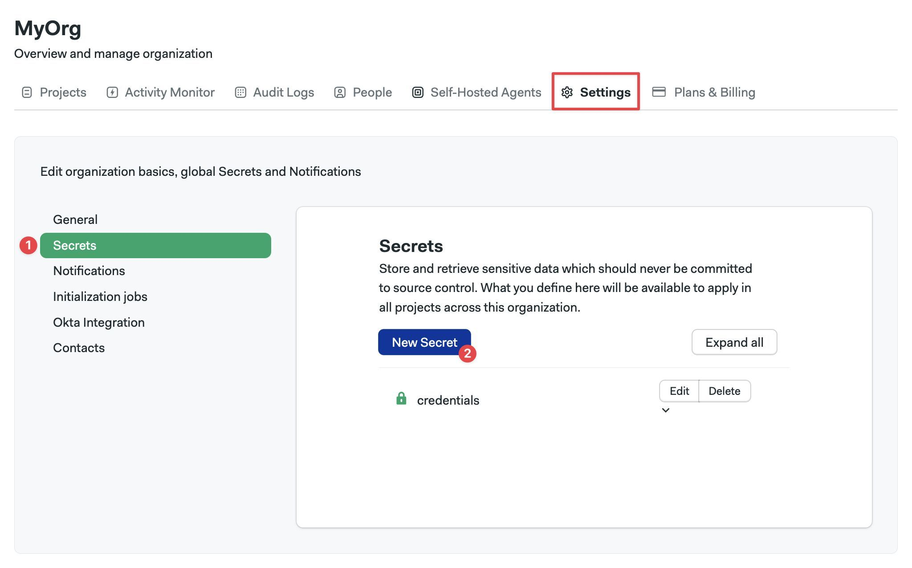
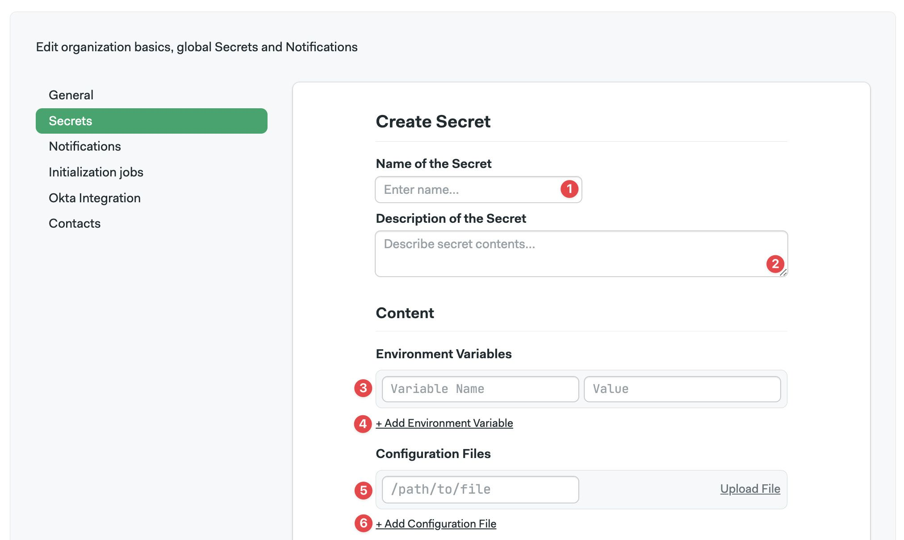
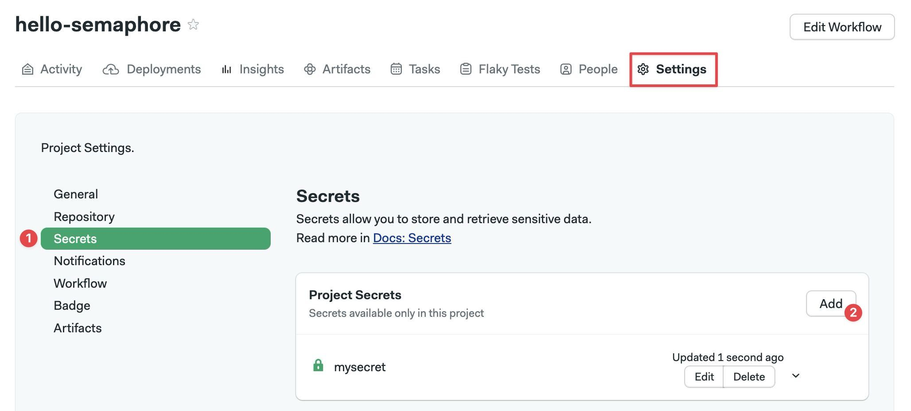
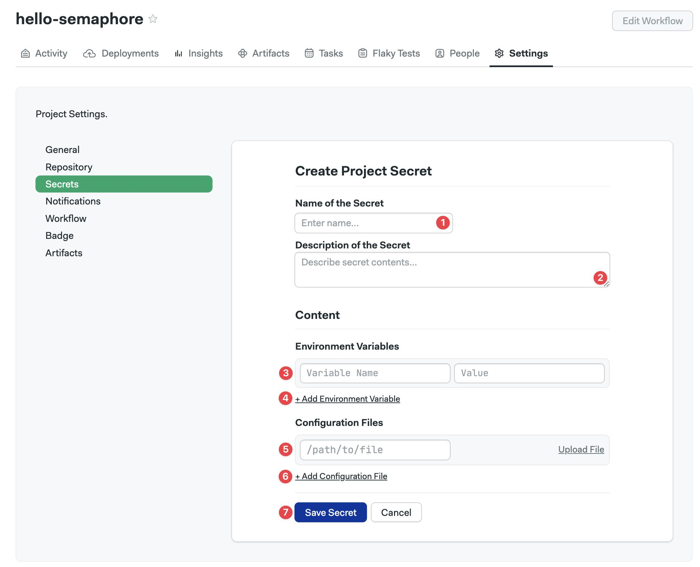

# Secrets

import Tabs from '@theme/Tabs';
import TabItem from '@theme/TabItem';
import Available from '@site/src/components/Available';
import VideoTutorial from '@site/src/components/VideoTutorial';
import Steps from '@site/src/components/Steps';

<VideoTutorial title="How to use secrets" src="https://www.youtube.com/embed/rAJIRX81DeA"/>

Secrets store sensitive data like API keys, passwords, and SSH keys. This page explains the types of secrets, their scopes, and how to create and secure them.

## Overview {#overview}

Secrets are encrypted on creation and decrypted at runtime when required for [jobs](./jobs#secrets). Once a secret is created, its content is no longer visible to users.

Secrets implement two types of values:

- **Variables**: key-value pairs available as environment variables in jobs
- **Files**: arbitrary files injected into the job environment at a specified path

Secrets can be created in two scopes:

- [Server](./organizations): server secrets are available to all projects in your Semaphore instance
- [Project](./projects): project secrets are available only to a single project

<details>
<summary>How are secret collisions managed?</summary>
<div>

A collision happens when secrets with the same name are defined on multiple levels. Collisions are resolved by giving precedence to the narrowest scope. In other words:

- Project secrets win over server secrets
- Server secrets take the least precedence

</div>
</details>

## How to create server secrets {#org-secrets}

Server secrets are available to all the [projects](./projects) in the Semaphore instance. You can create secrets using either the UI or the command line.


<Tabs groupId="ui-cli">
<TabItem value="ui" label="UI">

To create an server secret, go to the [organization settings](./organizations#general-settings) and:


<Steps>

1. Select **Secrets**
2. Press **New Secret**

    

3. Enter the name of the secret
4. Add an optional description
5. To add a key-value pair, enter the secret name and value
6. Add more variables as needed
7. To add a file, specify the path and upload the file
8. Add more files as needed
9. Press **Save secret** 

    

</Steps>

</TabItem>
<TabItem value="cli" label="CLI">

To create a secret using the Semaphore command-line tool, use:

```shell title="Creating a secret"
sem create secret <secret-name> \
  -e <VAR_NAME>=<var_value> \
  -f <local_file_path>:<agent_file_path>
```

You can define multiple environment variables at once using:

```shell title="Defining multiple variables example"
sem create secret awskey \
  -e AWS_ACCESS_KEY_ID=your-value \
  -e AWS_SECRET_KEYID=your-value
```

In addition, you can upload multiple files as secrets using:

```shell title="Creating multiple secret files example"
sem create secret sshkeys \
  -f $HOME/.ssh/id_rsa:/home/semaphore/.ssh/id_rsa \
  -f $HOME/.ssh/id_rsa.pub:/home/semaphore/.ssh/id_rsa.pub
```

To view all server secrets, use:

```shell title="Viewing server secrets"
$ sem get secret
NAME                   AGE
awskey                 1d
sshkeys                1d
```

To view a specific secret, use `sem get secret <secret-name>`:

```shell title="Viewing a secret"
$ sem get secret awskey
apiVersion: v1beta
kind: Secret
metadata:
  name: awskey
  id: 31887bfb-fac5-4f5b-9a6a-059ecebcc851
  create_time: 1556828155
  update_time: 1621528405
data:
  env_vars:
  - name: AWS_ACCESS_KEY_ID
  - name: AWS_SECRET_ACCESS_KEY
  files: []
```

To edit a secret:


<Steps>

1. Run `sem edit secret <secret-name>`
2. Make your changes in the editor
3. Save and exit the editor to apply your changes

</Steps>

</TabItem>
</Tabs>

To create secrets with the Semaphore API, see the [API reference](../reference/api).

<!-- new api: [API reference page](../openapi-spec/secrets-list)-->

## How to create project secrets {#create-project-secrets}

<Available plans={['Startup']}/>

Project secrets are only available to the [project](./projects) they are tied to.

<Tabs groupId="ui-cli">
<TabItem value="ui" label="UI">

To create a project secret, navigate to your project and select the **Settings** tab.


<Steps>

1. Select **Secrets**
2. Press **Add**

    

3. Type the name of the secret
4. Type a description
5. To add a key-value pair, enter the secret name and value
6. Add more values as needed
7. To add a file, specify the path and upload the file
8. Add more files as needed
9. Press **Save secret**

    

</Steps>

</TabItem>
<TabItem value="cli" label="CLI">

To create a project secret using the Semaphore command-line tool, use:

```shell title="Creating a secret"
sem create secret -p <project-name> <secret-name> \
 -e <VAR_NAME>=<var_value> \
    -f <local_file_path>:<agent_file_path>
```

You can define multiple environment variables at once:

```shell title="Defining multiple variables example"
sem create secret -p myproject awskey \
 -e AWS_ACCESS_KEY_ID=your-value \
    -e AWS_SECRET_KEYID=your-value
```

In addition, you can upload multiple files as secrets:

```shell title="Creating multiple secret files example"
sem create secret -p myproject sshkeys \
 -f $HOME/.ssh/id_rsa:/home/semaphore/.ssh/id_rsa \
 -f $HOME/.ssh/id_rsa.pub:/home/semaphore/.ssh/id_rsa.pub
```

:::info

Absolute paths for `<agent_path_file>` are mounted relative to the root on the agent's disk. For example, `/etc/hosts` is mounted at `/etc/hosts` on the agent's machine or container.

Relative paths are mounted relative to the agent's service account home directory. For instance, `.ssh/id_rsa` is mounted as `/home/semaphore/.ssh/id_rsa`.

:::

To view all server secrets:

```shell title="Viewing project secrets"
$ sem get secret -p <project-name>
NAME                   AGE
awskey                 1d
sshkeys                1d
```

To view a specific secret, use `sem get secret -p <project-name> <secret-name>`:

```shell title="Viewing a secret"
$ sem get secret awskey
apiVersion: v1beta
kind: Secret
metadata:
  name: awskey
  id: 31887bfb-fac5-4f5b-9a6a-059ecebcc851
  create_time: 1556828155
  update_time: 1621528405
data:
  env_vars:
  - name: AWS_ACCESS_KEY_ID
  - name: AWS_SECRET_ACCESS_KEY
  files: []
```

To edit a secret:

<Steps>

1. Run `sem edit secret -p <project-name> <secret-name>`
2. Make your changes in the editor
3. Save and exit the editor to apply your changes

</Steps>

</TabItem>
</Tabs>

Note that if a secret is defined with the same name at both the server and project levels, the project-level secret overrides the server-level secret.

To create secrets with the Semaphore API, see the [Semaphore API](../reference/api).

<!-- new api: [API reference page](../openapi-spec/project-secrets-list) -->

## Private repositories and dependencies {#private-dependencies}

Sometimes, you need to access dependencies from private Git repositories. Dependency managers like Bundler, Yarn, and Go modules can access private repositories if you provide an authenticated SSH key in your CI job.

### Configuring an SSH key pair {#ssh-keys}

Dependency managers might need to authenticate with SSH to access private repositories.

Follow these steps to set up authentication:

<Steps>

1. Create an SSH key pair. For example:

    ```shell
    ssh-keygen -t rsa -f id_rsa_semaphoreci
    ```

2. Add the SSH public key to GitHub or BitBucket. See [deploy keys](https://developer.github.com/v3/guides/managing-deploy-keys/) for more information

3. Add the SSH private key as a secret in Semaphore

    For example, upload the private key as a secret to the path `.ssh/id_rsa_semaphoreci`

4. Import the secret in your job and use the dependency manager as usual. For example:

    ```shell
    checkout
    chmod 0600 ~/.ssh/id_rsa_semaphoreci
    ssh-add ~/.ssh/id_rsa_semaphoreci
    bundle install
    ```
  
</Steps>

## See also

- [How to create secrets with the Semaphore CLI](../reference/toolbox)
- [How to manage server secrets](./organizations.md)
- [Semaphore API](../reference/api)

<!-- new api: 

- [How to create secrets with the Semaphore API](../openapi-spec/secrets-list)

-->
