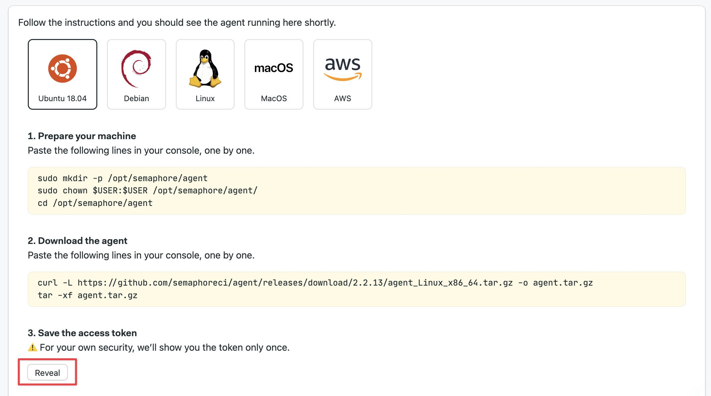
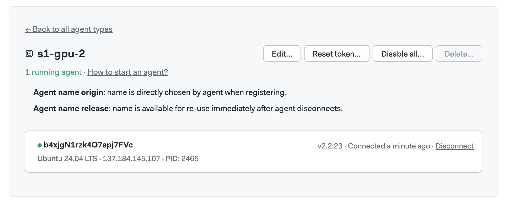
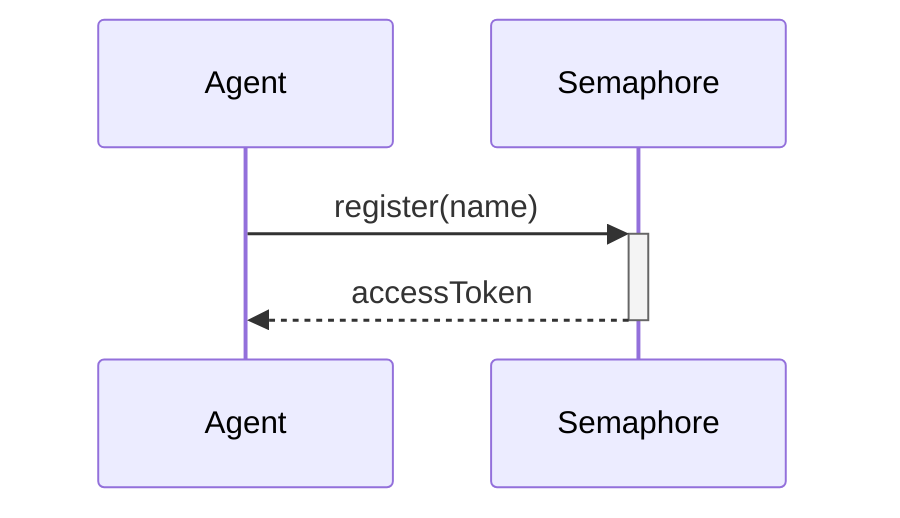
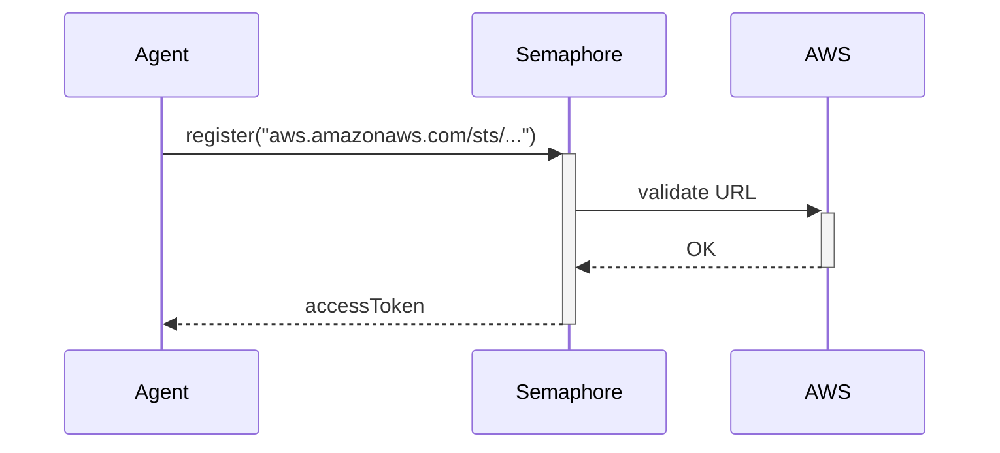
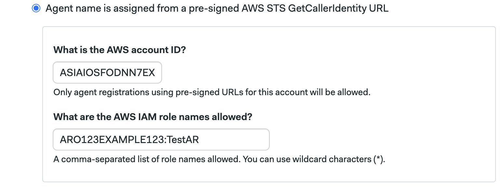

# Install Agents

import Tabs from '@theme/Tabs';
import TabItem from '@theme/TabItem';
import Available from '@site/src/components/Available';
import VideoTutorial from '@site/src/components/VideoTutorial';
import Steps from '@site/src/components/Steps';

This page explains how to install [self-hosted agents](./self-hosted) on different platforms.

## Overview

Before you can run jobs in your hardware, you need to install and register the self-hosted agent stack. This page explains how to install the stack on several platforms.

## How to register agent type {#register-agent}

The agent type is the name assigned to agents running on the same hardware or platform. Semaphore expects all self-hosted agents to belong to one agent type.

To register a self-hosted agent type ensure you're using an [Admin or Owner account](./rbac#org-owner) and follow these steps:

<Steps>

1. Press **Agents** near the top-left corner of the Semaphore homepage
2. Press **Create new**
3. Type the name of the agent type. Self hosted agents all begin with `s1-`, e.g. `s1-gpu-2`
4. Select the [how the agent name is assigned](#name-assign)
5. Select [when the agent name is released](#name-release)
6. Press **Register**

    

</Steps>

The next page shows detailed instructions to install and register the self-hosted. Select the platform you're using and press **Reveal** to view the registration token. Save it in a safe place for the next step.



Follow the on-screen instructions. When the agent connects you should be able to see it on the self-hosted agents page.



## Agent name assignment {#name-assign}

Every agent must have a unique name. There are two ways in which the name can be assigned:

- **Name assigned by agent**: the agent provides its own name
- **Name assigned by AWS STS**: agents running on AWS can get an additional level of security by validating their name with [AWS Security Token Service](https://docs.aws.amazon.com/general/latest/gr/sts.html)

### Name assigned by the agent {#name-agent}

In this mode, the agent selects its own name and sends it during registration.



The agent picks a random name by default. You can override the name by specifying it during service start. For example:

```shell title="Agent start with name"
agent start --name my-agent-name
```

You may need to edit the configuration file of the service manager to change the name. For example, to change the agent name when using systemd, follow these steps:

<Steps>

1. Edit the service file

    ```shell
    sudo systemctl edit semaphore-agent.service
    ```

2. Override `ExecStart` to add the `--name` argument and save the file

    ```text title="Add an override to the systemd service file"
    [Service]
    ExecStart=
    ExecStart=/opt/semaphore/agent/agent start --config-file /opt/semaphore/agent/config.yaml --name my-agent-name
    ```

3. Restart the service and confirm it has successfully registered

    ```shell
    sudo systemctl restart semaphore-agent
    ```

</Steps>

:::note

Agent names should have between 8 and 80 characters.

:::

### Name assigned by AWS STS {#name-sts}

[AWS Security Token Service](https://docs.aws.amazon.com/general/latest/gr/sts.html) provides a second layer of security that ensures only allowed agents can connect with Semaphore.

To use this option, you must run your agent in AWS EC2 instances. The [Autoscaling AWS Stack](./self-hosted-aws) uses this feature by default.

When AWS STS is enabled, the agent sends a name request to Semaphore during registration, which in turn validates the access with the AWS-secured endpoint. This mechanism thwarts attempts to register rogue agents even if the attacked has secured access to a valid registration token.



To use AWS STS name assignments, follow these steps:

<Steps>

1. Create an IAM user on AWS with permissions to create and delete EC2 instances
2. Select the option **Agent name is assigned from a pre-signed AWS STS GetCallerIdentity URL** during [agent registration](#register-agent)
3. Type your AWS account ID
4. Type the list of roles the [IAM user is allowed to assume](https://docs.aws.amazon.com/STS/latest/APIReference/API_AssumeRole.html)
5. Press **Save**

    

</Steps>

## Name release {#name-release}

You can select what happens when the agent name when it disconnects. The default behavior is to release for reuse the name immediately after disconnection. 

On some cases, however, you may want to keep the name reserved, for example:

- If you want to connect to self-hosted agent machine to troubleshoot some issue
- If you're using AWS STS endpoints, you may want to reserve the name for the duration of the EC2 instance

You can select how long to reserve the agent name during [agent registration](#register-agent).

### AWS Autoscaler {#aws}

With AWS (or any other cloud), you can spin up an EC2 instance and install the Ubuntu, generic Linux, macOS, or Windows agents. 

Semaphore, however, also provides an AWS stack to run an auto-scaling fleet of agents. To learn how this feature works, see the [Autoscaling agents in AWS page](./self-hosted-aws.md).

## See also

- [How to configure self-hosted agents](./self-hosted-configure)
- [How to run an autoscaling fleet of agents in AWS](./self-hosted-aws)
- [Self-hosted agents configuration reference](../reference/self-hosted-config)
