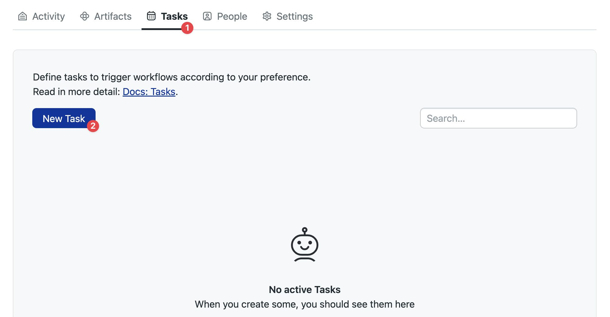
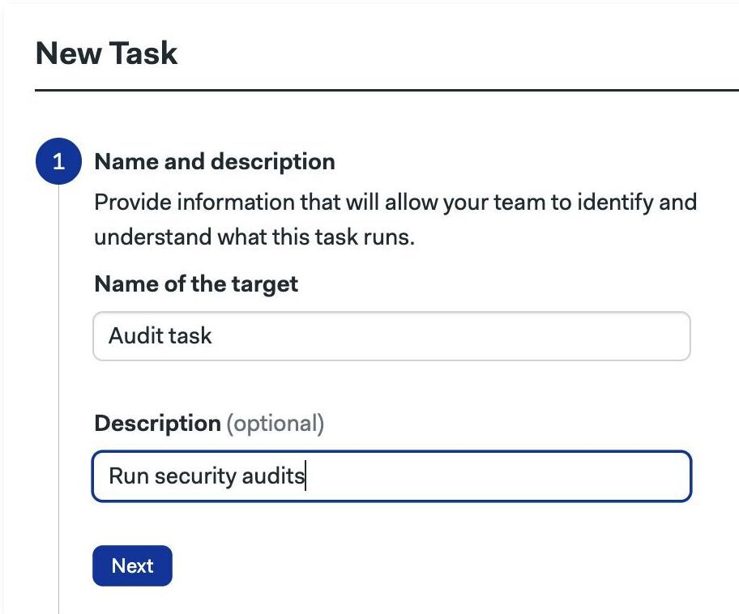
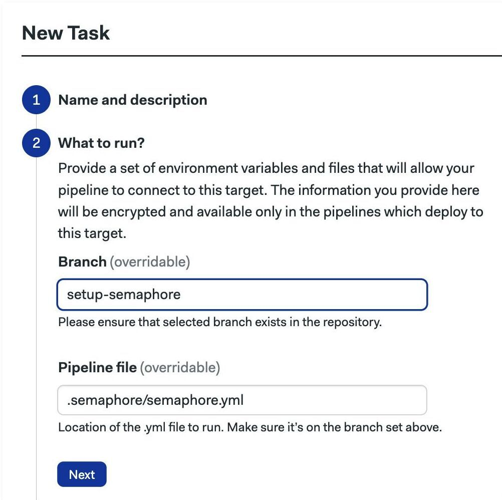
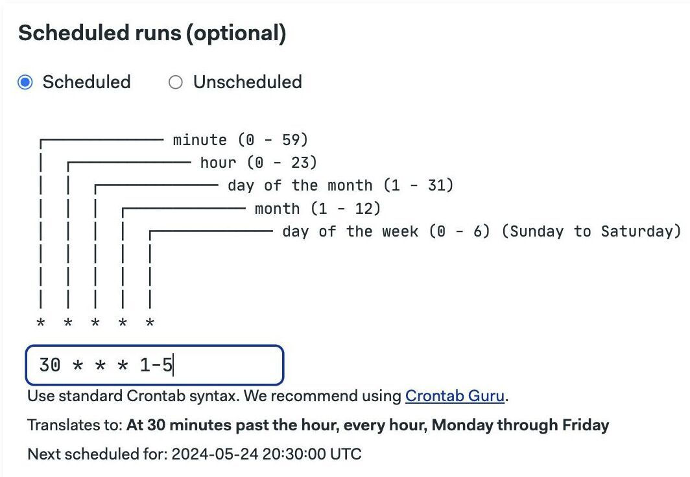
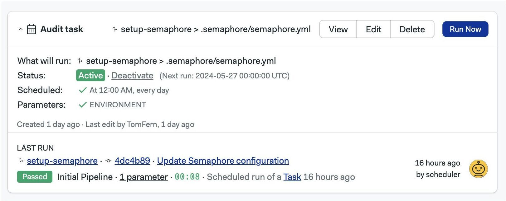
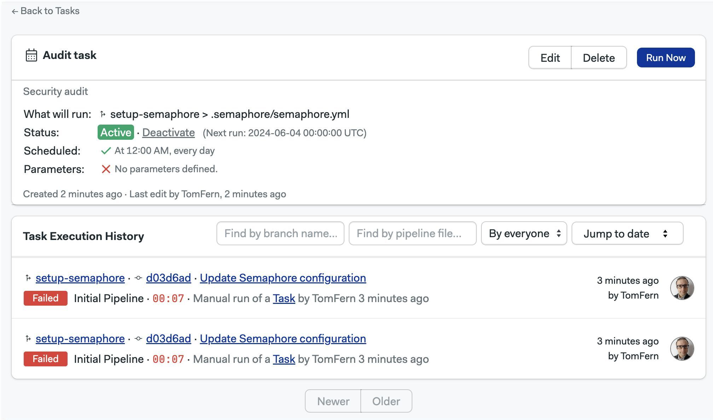
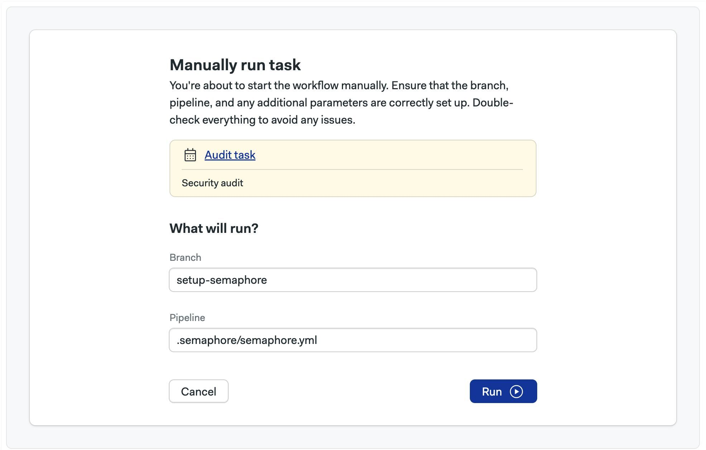
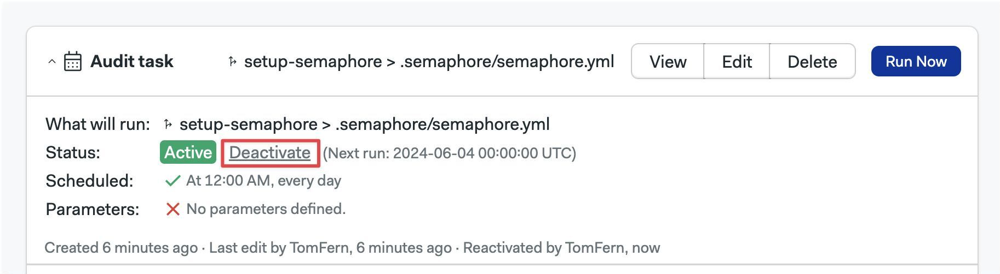
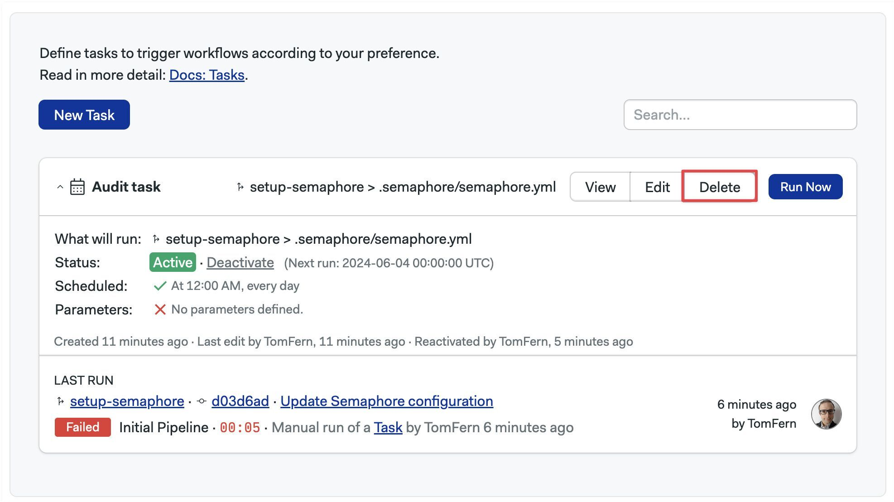

# Tasks

import Tabs from '@theme/Tabs';
import TabItem from '@theme/TabItem';
import Available from '@site/src/components/Available';
import VideoTutorial from '@site/src/components/VideoTutorial';
import Steps from '@site/src/components/Steps';

<VideoTutorial title="How to set up Tasks" src="https://www.youtube.com/embed/zu1WORQUJAM?si=hR_FwyMe4Yd2Lf-H" />

Task allow you to trigger specific [pipelines](./pipelines) on a schedule or manually. This page explains how to create and run tasks, and what settings are available.

## Overview {#overview}

The main use cases for tasks are to:

- Run long or resource-intensive jobs outside the usual continuous integration workflow.
- Periodically rebuild an application or run security audits
- Continue testing projects even when they are inactive (not getting new commits)
- Run arbitrary code, track results, and get notifications
- Execute maintenance chores such as such database backups
- Running exceptional corrective actions such as pruning the [cache](./jobs#cache)


## Limitations {#limitations}

Scheduled tasks have some limitations:

- Pipelines are triggered at a random second inside the scheduled minute. This helps disperse the load on the system.
- Tasks do not start automatically in the first 60 seconds after being created or edited.
- In the rare cases in which the scheduler fails to start a task, Semaphore retries it every 10 seconds for the following 15 minutes.

## How to create a task {#manage-tasks}

To create a task, open your project and follow these steps. You can create tasks with the UI, or use Semaphore CLI. Additionally, you can use the  [Semaphore API](../reference/api) to manage tasks.

<!-- new api: [Semaphore Task API](../openapi-spec/tasks-list) -->

<Tabs groupId="ui-cli">
<TabItem value="ui" label="UI">

<Steps>

1. Select the **Tasks** tab
2. Press **New task**

    

3. Type the task's name and description
4. Press **Next**

    

5. Type the repository branch and [pipeline](./pipelines) file to execute. The only requisite is that the pipeline file exists in that branch. It doesn't need (but it can) to be connected with a promotion to any other pipeline
6. Press **Next**

    

7. Press **Next**
8. Define the schedule using [crontab syntax](https://crontab.guru/). The example below is running Check the option "Unscheduled" if you want to only run the task manually

    

9. Press **Next** and **Create**

</Steps>

</TabItem>
<TabItem value="cli" label="CLI">

You can add tasks by editing the project using the [Semaphore command line tool](../reference/semaphore-cli).

<Steps>

1. Run `sem edit project <project-name>`
2. An editor should open showing the project settings. For example, this is a project called "hello-semaphore"

    ```yaml title="sem edit project hello-semaphore"
    apiVersion: v1alpha
    kind: Project
    metadata:
      name: hello-semaphore
      id: a2ba1008-afc9-4326-b994-58fb816fc4d5
      description: "This is a test project"
    # ...
    ```
3. Add a `task` section. Each item in the list is a task. The example below shows one task:
   - Task "nightly-deploys" runs the `nighthly-deploys.yml` on "master" branch pipeline at 12:15 am every day.

    ```yaml title="sem edit project hello-semaphore"
    # ...
    tasks:
    # task 1
        - name: nightly-deploys
          branch: master
          scheduled: true
          at: "15 12 * * *"
          pipeline_file: .semaphore/nightly-deploys.yml
    ```

4. Save the file to submit your changes

</Steps>

</TabItem>
</Tabs>

## How to view your tasks {#view-task}

Go to the **Tasks** tab in your project to view the configured tasks.



Press the **View** button to view the execution log for this task.




## How to run tasks manually {#run-tasks}

Go to the **Tasks** tab in your project to view the configured tasks. Pressing **Run now** shows you the following screen.



Here you can change the branch, pipeline file, and define parameter values. Press **Run** to start the task immediately.

You may also trigger a task using the [Semaphore API](../reference/api#tasks)

## How to pause a task {#deactivate-task}

Deactivating a task disables the schedule. Deactivated tasks can still be run manually. If you don't need the task or its history, [delete the task](#delete-task) instead.

Go to the **Tasks** tab in your project and:

<Steps>

1. Locate the task you want to deactivate.
2. Click the **Deactivate** link
3. Confirm the prompt

    

</Steps>

## How to delete a task {#delete-task}

When you delete a task all the execution history is also deleted. If you want to keep the execution history for the task, you can [pause the task](#deactivate-task). This prevents the task from running automatically.

To delete the task, go to the **Tasks** tab in your project and press the **Delete** button.



## See also

- [Semaphore CLI reference](../reference/semaphore-cli)
- [Plan job and block execution with pipelines](./pipelines)