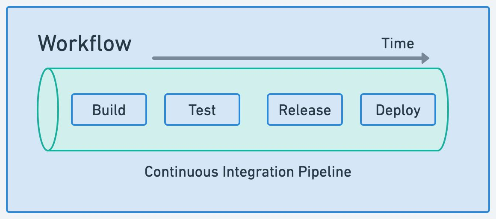
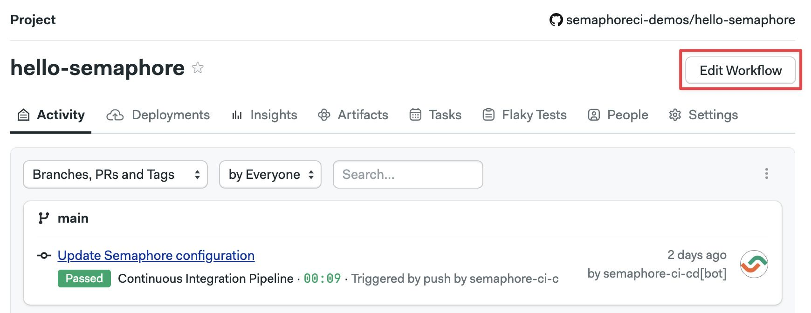
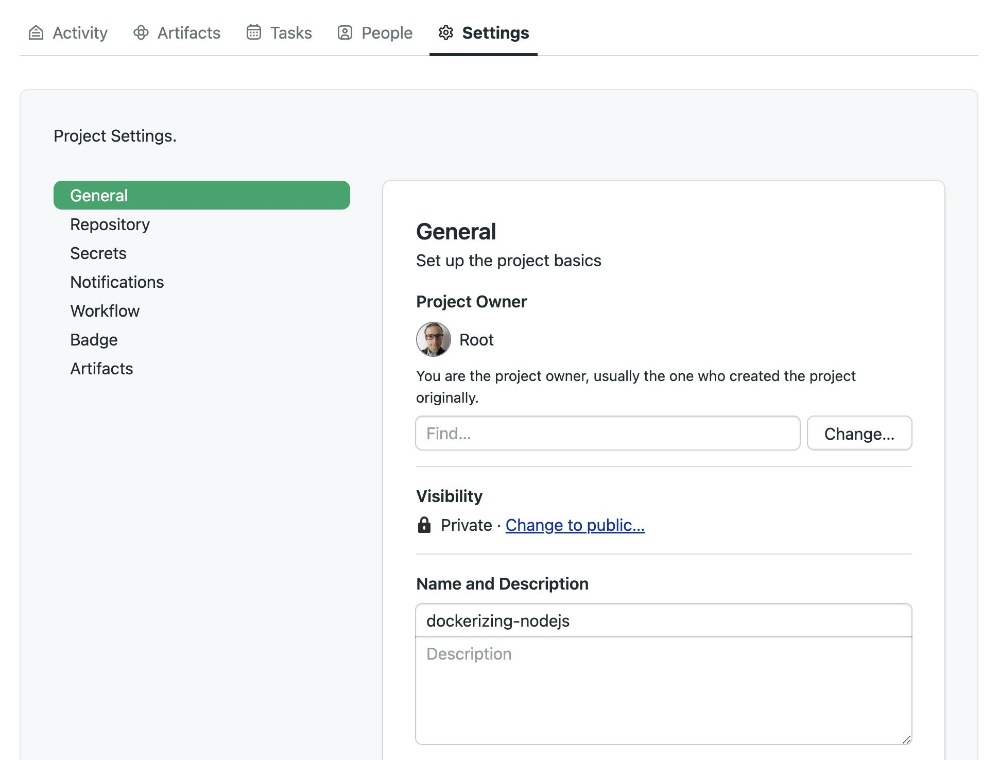

# Workflows

import Tabs from '@theme/Tabs';
import TabItem from '@theme/TabItem';
import Available from '@site/src/components/Available';
import VideoTutorial from '@site/src/components/VideoTutorial';
import Steps from '@site/src/components/Steps';

A *workflow* is a series of steps to build, test, release, or deploy your application. This page explains workflows, how they are triggered, and their settings.

:::tip

If this is your first time using Semaphore, check out [Guided Tour](../getting-started/guided-tour).

:::

## Overview

In the context of Continuous Integration and Delivery (CI/CD) a workflow implements automation to manage the development cycle from code to deployment.

Workflows in Semaphore consist of [jobs] in a pipeline. A [pipeline](./pipelines) defines the sequence of tasks to achieve goals like build, release, or deploy to production.



Before you can run a workflow in Semaphore you need:

- [Install](../getting-started/install) and configure Semaphore
- A repository on GitHub or BitBucket
- A Semaphore project linked to the repository
- One [pipeline](./pipelines)

The [project page](./projects#view-projects) shows all the recent workflows for the project. 


## Visual workflow editor {#workflow-editor}

You can define most aspects of your workflows using the visual editor. 

To access the editor, open one of your projects on and press **Edit Workflow**. All your changes are stored as YAML pipeline definitions on your Git repository. You can make changes using the visual editor, or edit the YAML directly by clicking on the pipeline YAML file.



See the [jobs page](./jobs) to learn how to define jobs and blocks.

## Workflow triggers

The following events or actions trigger workflows by default:

- Pushing commits into any branch
- Pushing Git tags
- Changing the pipeline
- Manually re-running workflows 
- Running pipelines using [Tasks](./tasks)

Additionally, you can configure workflows to be triggered by:

- Pull requests (not available on BitBucket projects)
- Pull request on forked repositories

The reason for the trigger can be determined at runtime by examining the Semaphore environment variables in the job. See the [environment variable reference page](../reference/env-vars#semaphore) for more details.

### How pull requests are handled {#pr}

Semaphore starts a workflow for every push to a pull request originating from a forked repository. For security reasons, secrets are disabled in jobs triggered in this way. You can [create an allow list](#project-triggers) with the secrets you want to expose in the project settings.

:::note

Instead of pushing the HEAD commit to the pull request, Semaphore uses the MERGE commit between the source and the upstream branch. You can find the SHA of the HEAD commit of the Pull Request in the [`SEMAPHORE_GIT_PR_SHA`](../reference/env-vars#pr-sha) environment variable.

:::

### How to customize triggers {#project-triggers}

Triggers are configured in the [project settings](./projects#general). To change what actions can trigger a workflow, follow these steps:

<Steps>

1. Open your project on Semaphore
2. Go to the **Settings** tab

    

3. In the **General** section scroll down to **What to build**
4. Change the settings and press **Save**

</Steps>

Selecting **Do not run on any events** disables all triggers, effectively pausing the project. You can, however, still run workflows manually or with [tasks](./tasks).


Selecting **Run on** allows you to configure what triggers are enabled for the project.

- The **Branches** option allows you to run workflows on all branches or configure an allow list with branch names. Regular expressions are supported

- The **Tags** options work the same but for Git tags


:::note

**Whitelisted only** only affects branches and tags created *after* enabling this setting. Branches and tags that existed before the setting is enabled are not affected and are always built.

:::

- Enabling **Pull requests** option allows Semaphore to run workflows on pull requests originating in the same repository
- The **Forked pull request** works the same for pull requests originating from forked pull requests. [To prevent security leaks](#pr), you can configure a list of allowed secrets and GitHub/BitBucket usernames that can trigger workflows in this way
  


### Approving PRs with `/sem-approve` {#sem-approve}

Blocked pull requests can be manually approved by adding a comment containing `/sem-approve` string in the PR conversation. Anyone who can run a forked pull request can also approve one.

Approving forked pull requests is limited to new comments only and does not work with comment edits. Due to security concerns, `/sem-approve` will work only once. Subsequent pushes to the forked pull request must be approved again.

## How to skip commits {#skip}

If you don't want to start a workflow, type one of the following strings in the commit message. 

- `[ci skip]`
- `[skip ci]`


For example, this push does not trigger a Semaphore pipeline execution, it is completely ignored:

```shell title="Skipping a commit"
git add -A
git commit -m "[skip ci] Initial commit"
git push origin main
```

:::note notes

- Be careful when squashing commits as they can contain skip messages

:::
